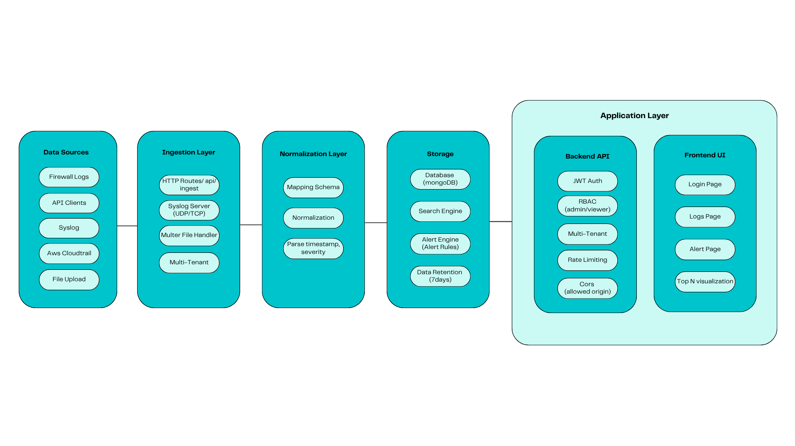

## Overview

LogDemo is a **multi-tenant log management system** designed to ingest, normalize, store, search, and analyze logs from multiple sources. It provides real-time alerting capabilities and a responsive web dashboard for log visualization and management.

## Key Features

- Multi-source log ingestion (HTTP API, Syslog UDP/TCP, File Upload, AWS CloudTrail)
- Centralized 26-field schema normalization
- Multi-tenant data isolation
- Role-based access control (Admin/Viewer)
- Real-time alerting with email notifications (3 rule types: threshold, frequency, pattern)
- Interactive dashboard with statistics and filtering
- 7-day automatic data retention (TTL)

## System Architecture Diagram




## Technology Stack

### Frontend
- **React 18** - UI library with hooks
- **React Router v6** - Client-side routing
- **Fetch API** - HTTP client for API calls
- **localStorage** - Token persistence

### Backend
- **Node.js v20** - JavaScript runtime
- **Express.js** - Web framework
- **ES Modules** - Modern JavaScript modules
- **JWT** - Authentication tokens
- **bcrypt** - Password hashing

### Database
- **MongoDB 7.0** - Document database
- **Mongoose** - ODM (Object Data Modeling)
- **TTL Indexes** - Automatic data retention

### External Services
- **Resend** - Email delivery API (100 emails/day free)

### DevOps
- **Docker** - Containerization
- **Docker Compose** - Multi-container orchestration
- **Git** - Version control


## Data Flow

### 1. Log Ingestion Flow
```
Source → HTTP/Syslog → Normalizer → MongoDB → Search/Alert
```

### 2. Search Flow
```
User → Frontend → API → MongoDB Query → Aggregation → Response → Display
```

### 3. Alert Flow
```
Alert Engine → Query Logs → Match Rule → Create Notification → Send Email
```

### Tenant Separation 

1. **Data Isolation** - Company A cannot see Company B's logs
2. **Admin Cross-Tenant** - Super admin can view all tenants
3. **Separate Statistics** - Each tenant has independent metrics
4. **Independent Alerts** - Alert rules scoped per tenant
5. **User Segregation** - Users tied to single tenant (except admin)

## Component Details

### 1. Normalizer Service
**File:** `backend/src/services/normalizer.js`

**Responsibilities:**
- Convert diverse log formats to unified 26-field schema
- Extract structured data from unstructured logs (regex patterns for Syslog)
- Map source-specific fields to standard fields
- Preserve original message in `raw` field

**26-Field Normalized Schema:**
```javascript
{
  timestamp: Date,              // RFC3339 format
  tenant: String,               // Multi-tenant identifier
  source: String,               // firewall|crowdstrike|aws|m365|ad|api|network
  severity: Number,             // 0-10 scale
  vendor: String,               // e.g., "CrowdStrike", "AWS", "Palo Alto"
  product: String,              // e.g., "Falcon", "CloudTrail"
  event_type: String,           // auth|network|system|database|application|security
  event_subtype: String,        // More specific categorization
  action: String,               // allow|deny|create|delete|login|logout|alert
  src_ip: String,
  src_port: Number,
  dst_ip: String,
  dst_port: Number,
  protocol: String,             // TCP|UDP|ICMP|HTTP
  user: String,
  host: String,
  process: String,
  url: String,
  http_method: String,          // GET|POST|PUT|DELETE
  status_code: Number,          // HTTP status code
  rule_name: String,
  rule_id: String,
  cloud: {
    account_id: String,
    region: String,
    service: String
  },
  message: String,              // Human-readable summary
  raw: String,                  // Original log (required)
  _tags: [String]               // Tags/labels
}
```

**Supported Sources:**
- `http` - Direct JSON ingestion via API
- `syslog` - Parse syslog format (extracts IPs, ports, protocol, action via regex)
- `aws-cloudtrail` - AWS CloudTrail events (flattens nested structure)
- `file-upload` - File upload (JSON, JSONL, TXT)
- `firewall` - Firewall events
- `custom` - Generic JSON logs

### 2. Alert Engine
**File:** `backend/src/services/alertEngine.js`

**Features:**
- **Threshold Alerts** - Trigger when severity >= X
- **Frequency Alerts** - Trigger on X occurrences in Y minutes
- **Pattern Matching** - Regex-based log filtering
- **Cooldown Period** - Prevent alert spam
- **Multi-action** - UI notification + Email + Webhook

### 3. Syslog Server
**File:** `backend/src/services/syslogServer.js`

**Protocols:**
- UDP Port 5140 (fast, connectionless)
- TCP Port 5140 (reliable, connection-based)

**Format Support:**
- RFC 3164 (BSD syslog)
- RFC 5424 (Modern syslog)

## Security Architecture

### 1. Authentication (AuthN)
**Mechanism:** JWT (JSON Web Tokens)

**Login Flow:**
```
User → POST /api/auth/login → Validate credentials → Generate JWT → Return token
```

**Token Structure:**
```json
{
  "userId": "507f1f77bcf86cd799439011",
  "email": "admin@example.com",
  "role": "admin",
  "tenant": "default",
  "iat": 1697284800,
  "exp": 1697371200
}
```

### 2. Authorization (AuthZ)
**Role-Based Access Control (RBAC):**

| Role | Permissions |
|------|-------------|
| **Admin** | Full access: view all logs, create alerts, switch tenants |
| **Viewer** | Read-only: view own tenant's logs, cannot create alerts |

### 3. Data Security
- **Password Hashing:** bcrypt with 12 salt rounds
- **Tenant Isolation:** All queries filtered by tenant
- **Rate Limiting:** 
  - Auth endpoints: 5 requests/15 minutes
  - Search endpoints: 100 requests/15 minutes
  - Ingest endpoints: 200 requests/15 minutes

### 4. TLS/HTTPS
- **SaaS/Cloud:** Automatic TLS via Let's Encrypt (TLS 1.2+)
- **Appliance:** Self-signed or Let's Encrypt certificates
- **Security Headers:** Helmet.js (HSTS, CSP, X-Frame-Options, etc.)
- **Setup Details:** See `/docs/SETUP.md`
